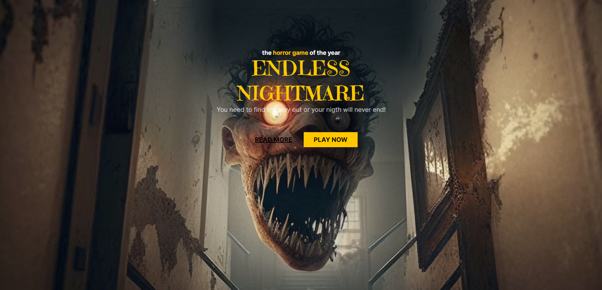

<h1 align="center"> 👾 Landing Page Game Horror 👾 </h1>

Esse projeto foi elaborado pelo programa Rocketseat para ensino de tecnologias WEB que tive a satisfação de concluir o projeto com sucesso!  

  <a href="#-tecnologias">Tecnologias</a>&nbsp;&nbsp;&nbsp;|&nbsp;&nbsp;&nbsp;
  <a href="#-projeto">Projeto</a>&nbsp;&nbsp;&nbsp;|&nbsp;&nbsp;&nbsp;
  <a href="#-layout">Layout</a>&nbsp;&nbsp;&nbsp;|&nbsp;&nbsp;&nbsp;
  <a href="#memo-licença">Licença</a>

  

  

 

  

## 🚀 Tecnologias

Esse projeto foi desenvolvido com as seguintes tecnologias:

- HTML e CSS
- Figma
- Inteligência Artificial 
- Git e Github

## 💻 Projeto

Inicialmenete, o Projeto de Landing Page foi feito com o objetivo de estudar e colocar em prática o conhecimento adquiridos com HTML e CSS.

## Licença

Esse projeto está sob a licença MIT.

---